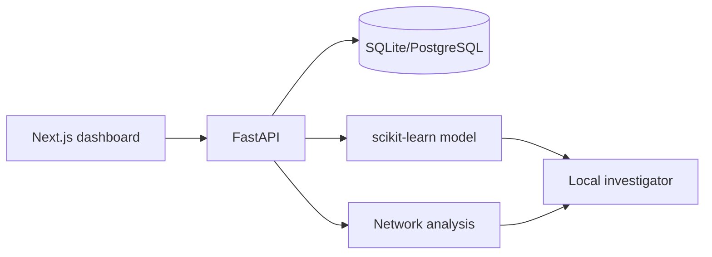

# FraudNet AI Architecture

The Next.js frontend presents overview, transaction, ring, investigation, model, and simulation views. FastAPI exposes validated REST endpoints and OpenAPI documentation. SQLAlchemy creates SQLite tables by default and accepts `DATABASE_URL` for PostgreSQL deployments.

Synthetic records are generated reproducibly, scored by an explainable Random Forest pipeline, and related with NetworkX-style entity relationships. The local investigator converts only observed signals into an explanation; an optional Razorpay TEST adapter can be added without affecting synthetic demo operation.

